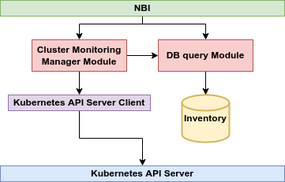

# Kubernetes Nodes Inventory

## Introduction
K8s-node-inventory is a software component responsible for collecting and monitoring 
information of registered Kubernetes clusters and their correspondent nodes providing
an intuitive REST-ful interface.
<div style="text-align:center">
  
  <p>k8s-node-inventory software architecture</p>
</div>

## Prerequisites

### System Requirements
- 1 vCPU
- 2GB RAM

### Software dependencies
- SQLite3 </br>
  ```bash
  sudo apt update
  sudo apt upgrade
  sudo apt install sqlite3
  sqlite3 --version
  ```

## Installation
The following procedures consider the previously listed dependencies fulfilled.

### Docker Compose
Create a sqlite3 database on the local filesystem:
```bash
  sqlite3 k8s-node-inventory ""
```
Create ```.env``` file in ```deployment/``` with the following content:
```bash
SQLITE = /path/to/sqlite
```
From ```k8s-node-inventory/``` run:
```bash
docker-compose -f deployment/docker-compose.yaml up -d
```

## Maintainers
**Michael De Angelis** - *Develop and Design* - m.deangelis@nextworks.it </br>

## License
This module is distributed under [Apache 2.0 License](LICENSE) terms.